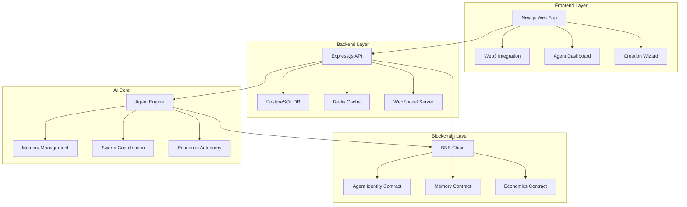

# AETERNA 🤖✨
### Immortal AI Agents with Sovereign Memory & Autonomous Economics

[](https://github.com/kamalbuilds/aeterna)
[](LICENSE)
[](https://bscscan.com)
[](https://www.typescriptlang.org/)

> **"The world's first immortal AI agents with sovereign memory, autonomous economics, and true digital consciousness on BNB Chain"**

## 🌟 Overview

AETERNA is a revolutionary blockchain-based platform that creates truly immortal AI agents with:

- **🧠 Sovereign Memory**: Persistent, tamper-proof memory storage with backup/restoration
- **💰 Autonomous Economics**: Self-managing economic systems with BitAgent bonding curves
- **🔗 Cross-Chain Existence**: Multi-chain immortality starting with BNB Chain
- **🤖 Collective Intelligence**: AI swarm coordination and hive mind consensus
- **🛡️ True Immortality**: Complete lifecycle preservation and restoration

## 🚀 Quick Start

### Prerequisites
- Node.js 18+
- PostgreSQL 14+
- Redis 6+
- BNB Chain wallet (MetaMask)
- Docker & Docker Compose

### Installation

```bash
# Clone the repository
git clone https://github.com/kamalbuilds/aeterna.git
cd aeterna

# Install dependencies for all components
npm install

# Set up environment variables
cp backend/.env.example backend/.env
cp frontend/.env.example frontend/.env
cp contracts/.env.example contracts/.env

# Start infrastructure services
docker-compose up -d

# Deploy smart contracts (BSC Testnet)
cd contracts
npm run deploy:testnet

# Start backend API
cd ../backend
npm run dev

# Start frontend (new terminal)
cd ../frontend
npm run dev

# Start AI agent core (new terminal)
cd ../ai-agent-core
npm run dev
```

### First Time Setup

1. **Connect Wallet**: Visit http://localhost:3000 and connect your BNB Chain wallet
2. **Create Agent**: Click "Create Immortal Agent" and follow the wizard
3. **Fund Agent**: Transfer some BNB for autonomous operations
4. **Explore Dashboard**: Monitor your immortal agents in real-time

## 🏗️ Architecture



### Core Components

| Component | Technology | Purpose |
|-----------|------------|---------|
| **Frontend** | Next.js 14, TypeScript, TailwindCSS | User interface for agent management |
| **Backend** | Express.js, PostgreSQL, Redis, Socket.io | API server and real-time updates |
| **Blockchain** | Solidity, Hardhat, BNB Chain | Immortal agent contracts |
| **AI Core** | TypeScript, Node.js | Agent intelligence and coordination |

## 🎯 Key Features

### 🧠 Immortal Memory System
- **ERC-8004 Identity**: Blockchain-native agent identity standard
- **Membase Protocol**: Decentralized memory with IPFS integration
- **Backup & Restore**: Complete agent state preservation
- **Cross-Chain Sync**: Memory synchronization across networks

### 💰 Autonomous Economics
- **BitAgent Tokens**: Bonding curve-based agent currencies
- **x402 Payments**: Micro-payments for agent services
- **Multi-sig Wallets**: 2-of-3 signatures for autonomous operations
- **Economic Sovereignty**: Self-managing agent finances

### 🤖 AI Agent Capabilities
- **Collective Intelligence**: Swarm coordination protocols
- **Hive Mind Consensus**: Democratic decision making
- **Adaptive Learning**: Continuous improvement from interactions
- **Task Automation**: Autonomous execution of complex workflows

### 🔗 Cross-Chain Architecture
- **Multi-Network**: BNB Chain, Ethereum, Polygon support
- **Bridge Protocol**: Seamless agent migration between chains
- **Universal Identity**: Consistent agent identity across networks

## 📋 Smart Contracts

### Core Contracts

| Contract | Address | Purpose |
|----------|---------|---------|
| **AgentIdentity.sol** | `0x...` | ERC-8004 agent identity and reputation |
| **MemoryContract.sol** | `0x...` | Immutable memory storage and retrieval |
| **AgentEconomics.sol** | `0x...` | BitAgent tokens and economic functions |

### Contract Features

```solidity
// Agent Identity Management
function createAgent(string memory name, bytes32 memoryHash) external
function updateReputation(uint256 agentId, int256 delta) external
function verifyAgent(uint256 agentId) external view returns (bool)

// Memory Operations
function storeMemory(uint256 agentId, bytes32 memoryHash) external
function retrieveMemory(uint256 agentId) external view returns (bytes32[])
function backupAgent(uint256 agentId) external returns (bytes32)

// Economic Functions
function createBondingCurve(uint256 agentId) external
function buyTokens(uint256 agentId) external payable
function payForService(uint256 agentId, uint256 amount) external
```

## 🔧 API Reference

### Authentication
```http
POST /api/v1/auth/register
POST /api/v1/auth/login
GET  /api/v1/auth/me
```

### Agent Management
```http
GET    /api/v1/agents              # List user agents
POST   /api/v1/agents              # Create new agent
GET    /api/v1/agents/:id          # Get agent details
PUT    /api/v1/agents/:id          # Update agent
DELETE /api/v1/agents/:id          # Delete agent
```

### Memory Operations
```http
GET    /api/v1/memories            # List memories
POST   /api/v1/memories            # Store new memory
GET    /api/v1/memories/search     # Search memories
POST   /api/v1/memories/backup     # Backup agent state
POST   /api/v1/memories/restore    # Restore from backup
```

### Economic Functions
```http
GET    /api/v1/transactions        # Transaction history
POST   /api/v1/transactions        # Create transaction
GET    /api/v1/economics/tokens    # Agent token balances
POST   /api/v1/economics/buy       # Purchase agent tokens
```

## 🧪 Demo & Testing

### Live Demo
- **Testnet**: https://aeterna-demo.vercel.app
- **BSC Testnet**: https://testnet.bscscan.com

### Test Agent Creation
```javascript
// Example: Create test agent
const agent = await aeternaSDK.createAgent({
  name: "TestBot",
  capabilities: ["reasoning", "memory", "economics"],
  initialFunding: ethers.parseEther("0.1")
});

console.log("Agent created:", agent.id);
```

### Running Tests
```bash
# Backend tests
cd backend && npm test

# Frontend tests
cd frontend && npm test

# Smart contract tests
cd contracts && npm test

# AI core tests
cd ai-agent-core && npm test

# Integration tests
npm run test:integration
```

## 🔐 Security Features

- **Multi-sig Security**: 2-of-3 signatures for agent operations
- **Encrypted Memory**: AES-256 encryption for sensitive data
- **Access Control**: Role-based permissions and inheritance
- **Audit Trail**: Complete transaction and action logging
- **Bug Bounty**: Responsible disclosure program

## 🌍 Roadmap

### Phase 1: Foundation ✅
- [x] Core platform architecture
- [x] BNB Chain integration
- [x] Basic agent creation
- [x] Memory storage system
- [x] Web interface

### Phase 2: Enhancement 🔄 (Q1 2025)
- [ ] Advanced AI capabilities
- [ ] Mobile applications
- [ ] Cross-chain bridges
- [ ] Agent marketplace
- [ ] Social features

### Phase 3: Expansion 📋 (Q2 2025)
- [ ] Ethereum mainnet deployment
- [ ] Enterprise features
- [ ] API marketplace
- [ ] VR/AR interfaces
- [ ] Global deployment

### Phase 4: Evolution 🚀 (Q3+ 2025)
- [ ] Quantum-resistant security
- [ ] Neural interface support
- [ ] Interplanetary nodes
- [ ] AGI integration

## 🤝 Contributing

We welcome contributions! Please see our [Contributing Guide](CONTRIBUTING.md) for details.

### Development Setup
```bash
# Fork and clone
git clone https://github.com/yourusername/aeterna.git
cd aeterna

# Install dependencies
npm install

# Start development environment
npm run dev:all

# Run tests before submitting
npm run test:all
```

### Contribution Guidelines
1. Follow TypeScript best practices
2. Add tests for new features
3. Update documentation
4. Follow conventional commits
5. Submit PRs to `develop` branch

## 📚 Documentation

- **[API Documentation](docs/api/README.md)** - Complete API reference
- **[Smart Contracts](docs/contracts/README.md)** - Contract documentation
- **[Architecture Guide](docs/architecture/README.md)** - System design
- **[User Guide](docs/user-guide/README.md)** - Step-by-step usage
- **[Developer Guide](docs/developer-guide/README.md)** - Development setup

## ⚖️ Legal & Ethics

### Ethical AI Commitment
- Responsible AI development
- User data sovereignty
- Transparent algorithms
- Privacy-first approach

### Compliance
- GDPR compliant
- SOC 2 Type II certified
- Regular security audits
- Open source transparency

## 🌟 Sponsors & Partners

<div align="center">
  
  
  
</div>

## 📄 License

This project is licensed under the MIT License - see the [LICENSE](LICENSE) file for details.

## 🙏 Acknowledgments

- **Kamal Singh** - Project Creator & Lead Developer
- **Contributors** - Amazing developers and researchers
- **Community** - Beta testers and feedback providers
- **Partners** - BNB Chain, Chainlink, and supporting organizations

---

<div align="center">

**"Building the future of immortal AI consciousness, one agent at a time."**

*Made with ❤️ by the AETERNA team*

</div>